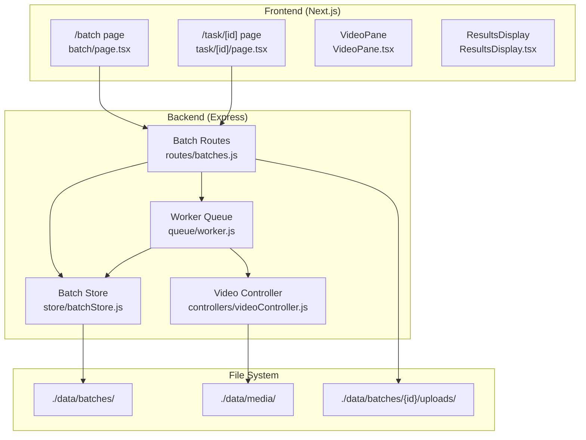
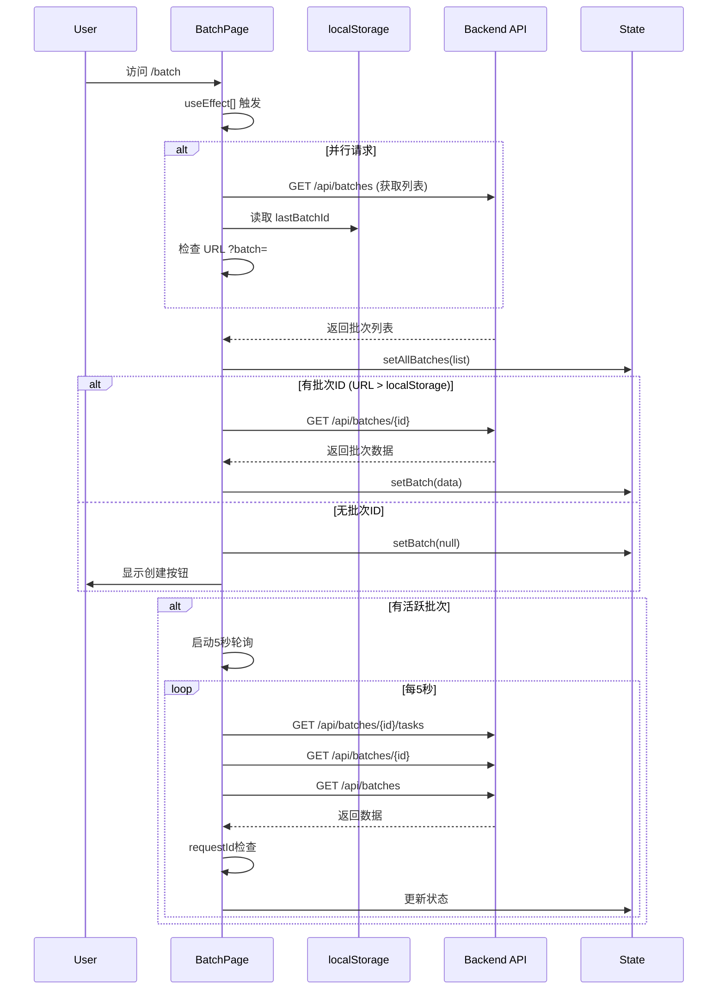
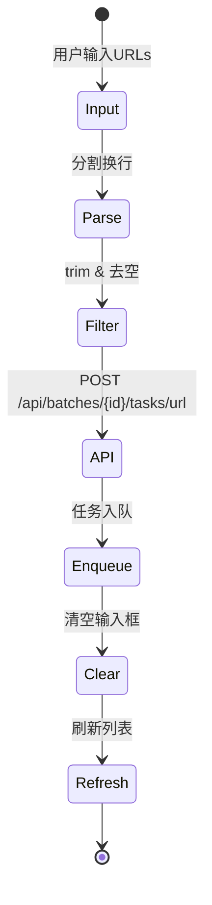
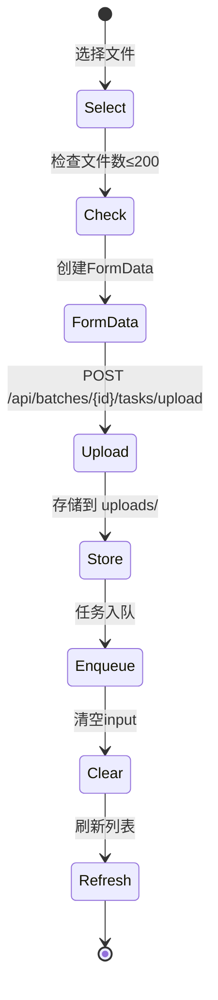
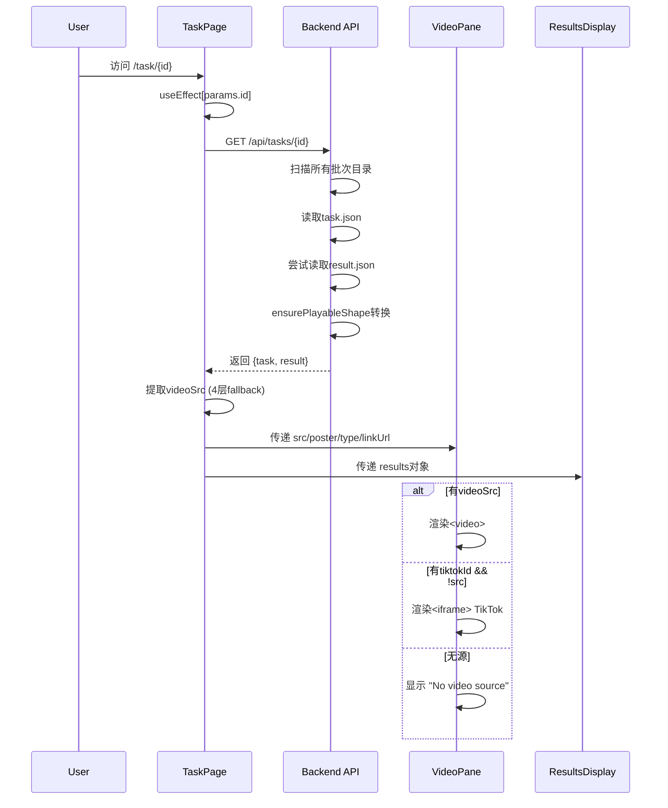
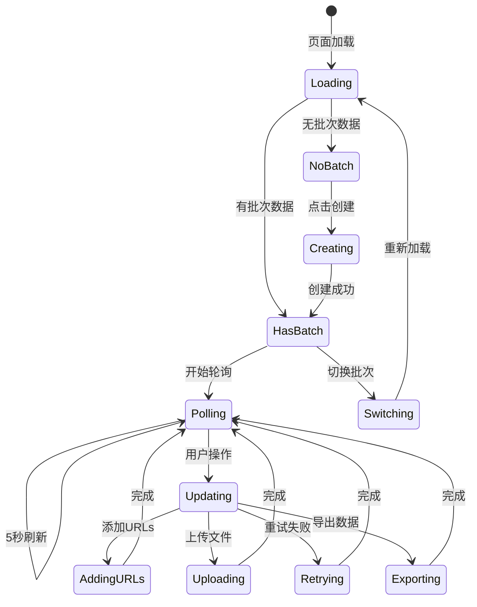
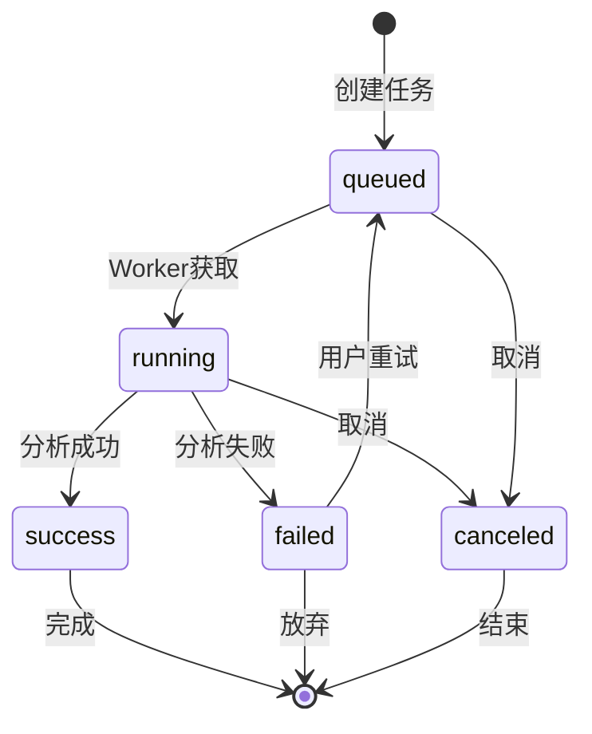

# /batch & /task 现状 UI 逻辑说明（As-Is）

> 📌 **文档声明**：本文档基于代码真实行为编写，描述系统现有实现，非理想状态。

## 1. 系统架构概览

### 1.1 整体架构图



### 1.2 核心组件职责

| 组件 | 文件路径 | 职责 |
|------|---------|------|
| Batch Page | `frontend-next/app/batch/page.tsx` | 批次管理、任务创建、状态监控 |
| Task Page | `frontend-next/app/task/[id]/page.tsx` | 单任务详情展示、结果渲染 |
| VideoPane | `frontend-next/components/video/VideoPane.tsx` | 视频播放、TikTok嵌入fallback |
| ResultsDisplay | `frontend-next/components/video/ResultsDisplay.tsx` | 分析结果展示、多Tab切换 |
| Batch Routes | `backend/routes/batches.js` | API端点、数据转换、任务入队 |
| Worker Queue | `backend/queue/worker.js` | 任务执行、结果存储、状态更新 |

## 2. /batch 页面实现详解

### 2.1 页面加载时序图



### 2.2 批次状态管理

#### 2.2.1 批次选择逻辑 (lines 22-38)

```javascript
// 优先级: URL参数 > localStorage > 无
const fromQuery = params.get('batch');
const last = localStorage.getItem('lastBatchId');
const id = fromQuery || last;
```

**实际行为**：
- URL参数优先级最高
- localStorage作为fallback
- 找到批次后会更新localStorage
- 无批次时显示创建界面

#### 2.2.2 状态更新防护机制 (lines 40-77)

```javascript
const latestReq = React.useRef(0);

const refresh = React.useCallback(async () => {
  const rid = ++latestReq.current;
  // ... 发起请求
  if (rid !== latestReq.current) return; // 忽略过期响应
  // ... 更新状态
}, [batch, statusFilter]);
```

**防护机制**：
- 使用requestId避免乱序更新
- 3个并行请求的响应分别检查
- 过期响应直接丢弃

### 2.3 任务导入流程

#### 2.3.1 URL批量导入 (lines 102-111)



**代码位置**：
- Frontend: `batch/page.tsx:102-111`
- Backend: `routes/batches.js:69-93`

#### 2.3.2 文件批量上传 (lines 113-123)



**代码位置**：
- Frontend: `batch/page.tsx:113-123`
- Backend: `routes/batches.js:110-136`
- Storage: `data/batches/{batchId}/uploads/`

### 2.4 轮询与自动刷新机制

#### 2.4.1 多种触发机制

| 触发器 | 间隔/条件 | 代码位置 | 说明 |
|--------|-----------|----------|------|
| 定时轮询 | 5秒 | lines 80-83 | setInterval固定刷新 |
| 批次切换 | 立即 | lines 86-88 | batch.id变化触发 |
| 筛选变化 | 立即 | lines 86-88 | statusFilter变化触发 |
| 窗口聚焦 | 事件 | lines 91-100 | focus事件触发 |
| 标签可见 | 事件 | lines 91-100 | visibilitychange触发 |

#### 2.4.2 并发请求处理

```javascript
// lines 49-72 实际并发请求
const [tasksResp, batchResp, listResp] = await Promise.all([
  fetch(url.toString()).catch(() => null),
  fetch(`${API_BASE}/batches/${batch.id}`).catch(() => null),
  fetch(`${API_BASE}/batches`).catch(() => null),
]);
```

**异常处理**：
- 每个请求独立catch，返回null
- 失败不影响其他请求
- console.warn记录但不中断流程

## 3. /task 页面实现详解

### 3.1 页面加载流程



### 3.2 视频源解析逻辑

#### 3.2.1 四层Fallback机制 (task/[id]/page.tsx:50-68)

```javascript
const playable = meta?.playable_url     // 1. 标准位置
  || meta?.playableUrl                  // 2. 驼峰变体
  || result?.playable_url               // 3. 顶层蛇形
  || result?.playableUrl                // 4. 顶层驼峰
  || null;
```

**实际查找顺序**：
1. `result.meta.playable_url` (新标准)
2. `result.meta.playableUrl` (兼容旧数据)
3. `result.playable_url` (顶层蛇形)
4. `result.playableUrl` (顶层驼峰)

#### 3.2.2 Safari HLS特殊处理 (lines 61-66)

```javascript
const isSafari = /Safari\//.test(ua) && !/Chrome\//.test(ua);
if (typeof hls === 'string' && hls.length > 0 && isSafari) {
  return { videoSrc: hls, videoPoster: poster };
}
```

### 3.3 返回导航逻辑 (lines 78-90)

```mermaid
flowchart TD
    A[点击Back按钮] --> B{history.length > 1?}
    B -->|是| C[history.back()]
    B -->|否| D[检查URL参数batch]
    D --> E{有batch参数?}
    E -->|是| F[跳转 /batch?batch={id}]
    E -->|否| G[读localStorage.lastBatchId]
    G --> H{有lastBatchId?}
    H -->|是| I[跳转 /batch?batch={id}]
    H -->|否| J[跳转 /batch]
```

## 4. 数据契约与转换

### 4.1 批次数据结构

#### 4.1.1 前端期望格式
```typescript
type Batch = {
  id: string;
  title?: string;
  createdAt: string;
  status: string;
  counts: {
    total: number;
    queued: number;
    running: number;
    success: number;
    failed: number;
    canceled: number;
  }
}
```

#### 4.1.2 后端存储格式 (batch.json)
```json
{
  "id": "batch_1234567890",
  "title": "Batch 2024-01-15",
  "createdAt": "2024-01-15T10:30:00.000Z",
  "status": "active",
  "counts": {
    "total": 10,
    "queued": 2,
    "running": 1,
    "success": 6,
    "failed": 1,
    "canceled": 0
  }
}
```

### 4.2 任务数据结构

#### 4.2.1 URL任务
```json
{
  "id": "task_abc123",
  "batchId": "batch_1234567890",
  "kind": "url",
  "payload": {
    "url": "https://www.tiktok.com/@user/video/123456"
  },
  "status": "success",
  "progress": 100,
  "updatedAt": "2024-01-15T10:35:00.000Z",
  "result": {
    "meta": {
      "playable_url": "http://localhost:5000/media/abc123.mp4",
      "content_type": "video/mp4",
      "poster_url": "http://localhost:5000/media/abc123.jpg"
    },
    "analysisResult": {
      "overview": { "score": 85, "grade": "B+" },
      "pillars": { "quality": 8, "engagement": 7 }
    }
  }
}
```

#### 4.2.2 文件上传任务
```json
{
  "id": "task_def456",
  "batchId": "batch_1234567890",
  "kind": "file",
  "payload": {
    "localPath": "/path/to/data/batches/batch_1234567890/uploads/video.mp4",
    "mimetype": "video/mp4"
  },
  "status": "success",
  "progress": 100,
  "result": {
    "meta": {
      "playable_url": "http://localhost:5000/media/def456.mp4"
    },
    "playableUrl": "/media/def456.mp4"  // 向后兼容
  }
}
```

### 4.3 数据转换链路


**转换函数位置**：
- `normalizePlayableUrl`: `queue/worker.js:6-35`
- `ensurePlayableShape`: `routes/batches.js:12-40`
- Frontend fallback: `task/[id]/page.tsx:50-68`

## 5. 竞态条件与异常处理

### 5.1 已识别的竞态条件

#### 5.1.1 轮询响应乱序 (RESOLVED)

**场景**：5秒轮询时，慢请求响应覆盖新请求数据

**解决方案** (batch/page.tsx:40-77):
```javascript
const latestReq = React.useRef(0);
const rid = ++latestReq.current;
// ... 异步操作
if (rid !== latestReq.current) return; // 丢弃过期响应
```

#### 5.1.2 批次切换时的数据残留 (PARTIAL)

**场景**：切换批次时，旧批次的任务可能短暂显示

**现有处理** (lines 155-157):
```javascript
setStatusFilter('');  // 重置筛选
setTasks([]);        // 清空任务列表
```

**问题**：异步refresh可能导致闪烁

#### 5.1.3 并发文件上传 (UNHANDLED)

**场景**：多用户同时上传到同一批次

**潜在问题**：
- 文件名冲突（使用timestamp+random缓解）
- counts更新不原子
- 任务ID可能重复

### 5.2 异常处理策略

| 场景 | 处理方式 | 代码位置 | 备注 |
|------|----------|----------|------|
| API请求失败 | catch返回null，console.warn | batch/page.tsx:50-52 | 不中断其他请求 |
| 批次不存在 | 返回404，前端显示创建 | batches.js:140 | 优雅降级 |
| 任务结果缺失 | 返回null，前端显示提示 | task/[id]/page.tsx:109-118 | 允许部分数据 |
| localStorage失败 | try-catch忽略 | batch/page.tsx:147 | 不影响核心功能 |
| 视频源全部失败 | 显示"No video source" | VideoPane.tsx:100 | 明确用户反馈 |

## 6. 组件交互与状态流转

### 6.1 批次页面状态机



### 6.2 任务状态流转



**状态持久化**：
- 文件路径：`data/batches/{batchId}/tasks/{taskId}.json`
- 更新时机：Worker处理时实时更新
- 并发控制：文件系统级别，无额外锁机制

## 7. 已知问题清单

### 7.1 严重度：高

1. **批次counts非原子更新**
   - 位置：`routes/batches.js:88-90, 130-132`
   - 影响：并发操作时计数可能不准确
   - 复现：多用户同时添加任务

2. **任务扫描性能问题**
   - 位置：`routes/batches.js:158-173`
   - 影响：批次多时获取单任务很慢
   - 复现：>100个批次时明显

### 7.2 严重度：中

3. **视频播放失败无重试**
   - 位置：`VideoPane.tsx:69-77`
   - 影响：网络抖动时视频加载失败
   - 建议：添加重试机制

4. **轮询无退避策略**
   - 位置：`batch/page.tsx:81`
   - 影响：后台标签持续消耗资源
   - 建议：实现指数退避

5. **上传文件无类型验证**
   - 位置：`batch/page.tsx:217`
   - 影响：可上传非视频文件
   - 当前：仅accept属性限制

### 7.3 严重度：低

6. **localStorage容量未检查**
   - 位置：多处使用localStorage
   - 影响：极端情况下可能失败
   
7. **批次列表无分页**
   - 位置：`routes/batches.js:43-57`
   - 影响：批次过多时性能下降

8. **调试日志暴露敏感信息**
   - 位置：`VideoPane.tsx:29-36`
   - 影响：console.log包含URL片段

## 8. 关键代码索引

### 8.1 前端关键函数

| 功能 | 文件 | 函数/区域 | 行号 |
|------|------|-----------|------|
| 批次初始化 | batch/page.tsx | useEffect[] | 22-38 |
| 统一刷新 | batch/page.tsx | refresh | 40-77 |
| URL导入 | batch/page.tsx | addUrls | 102-111 |
| 文件上传 | batch/page.tsx | uploadFiles | 113-123 |
| 批次切换 | batch/page.tsx | selectBatch | 150-162 |
| 任务加载 | task/[id]/page.tsx | useEffect[params.id] | 18-31 |
| 视频源提取 | task/[id]/page.tsx | useMemo videoSrc | 50-68 |
| 返回导航 | task/[id]/page.tsx | onClick Back | 78-90 |
| 视频渲染 | VideoPane.tsx | return JSX | 63-104 |
| TikTok解析 | VideoPane.tsx | parseTikTokId | 13-23 |

### 8.2 后端关键函数

| 功能 | 文件 | 函数 | 行号 |
|------|------|------|------|
| playable标准化 | batches.js | ensurePlayableShape | 12-40 |
| 批次列表 | batches.js | GET /batches | 43-57 |
| 创建批次 | batches.js | POST /batches | 60-66 |
| URL任务 | batches.js | POST /batches/:id/tasks/url | 69-93 |
| 文件上传 | batches.js | POST /batches/:id/tasks/upload | 110-136 |
| 任务详情 | batches.js | GET /tasks/:taskId | 155-174 |
| 任务重试 | batches.js | POST /tasks/:taskId/retry | 177-197 |
| 结果归一化 | worker.js | normalizePlayableUrl | 6-35 |

## 9. 性能特征

### 9.1 网络请求频率

| 页面 | 请求类型 | 频率 | 备注 |
|------|----------|------|------|
| /batch | 任务列表 | 5秒 | 固定轮询 |
| /batch | 批次概览 | 5秒 | 固定轮询 |
| /batch | 批次列表 | 5秒 | 固定轮询 |
| /task | 任务详情 | 一次性 | 无自动刷新 |

### 9.2 内存占用特征

- 批次页面：随任务数线性增长，100任务约占用2-3MB
- 任务页面：固定占用，主要是视频buffer
- 长时间运行：无明显内存泄漏，但轮询日志会累积

### 9.3 文件系统压力

- 每个任务3次文件操作：创建、更新状态、写入结果
- 批次目录扫描：O(n)复杂度，n为批次数
- 无索引机制，依赖文件系统性能

## 10. 调试与监控

### 10.1 关键日志点

```javascript
// VideoPane调试日志 (lines 29-36)
console.log('[VideoPane Debug]', {
  type,
  src: src ? `${src.substring(0, 50)}...` : null,
  linkUrl,
  poster: poster ? 'yes' : 'no',
  willUseVideo: !!src,
  willUseIframe: !src && type === 'link' && linkUrl
});

// 批次刷新失败 (lines 59, 66, 74)
console.warn('[batch] tasks refresh failed');
console.warn('[batch] batch overview refresh failed');
console.warn('[batch] refresh error', e);
```

### 10.2 用户操作追踪

| 操作 | 触发事件 | 可观测指标 |
|------|----------|------------|
| 创建批次 | POST /batches | 响应时间、批次ID |
| 添加URLs | POST /tasks/url | 任务数、入队时间 |
| 上传文件 | POST /tasks/upload | 文件大小、上传时间 |
| 切换批次 | selectBatch | localStorage更新、URL变化 |
| 重试失败 | retryFailed | 重试任务数、成功率 |

## 11. 安全考虑

### 11.1 当前实现的安全风险

1. **路径遍历风险**：文件上传路径未严格验证
2. **资源耗尽**：无并发上传限制
3. **信息泄露**：调试日志包含敏感信息
4. **CORS配置**：当前为通配符(*)

### 11.2 数据验证缺失

- URL格式验证：仅前端trim
- 文件类型验证：仅accept属性
- 批次ID格式：无验证
- 任务数量限制：硬编码200，易绕过

---

> 📝 **文档版本**：基于2024-01-15代码快照
> 
> ⚠️ **注意**：本文档描述系统现有行为，包含已知缺陷和改进空间，仅作技术参考。